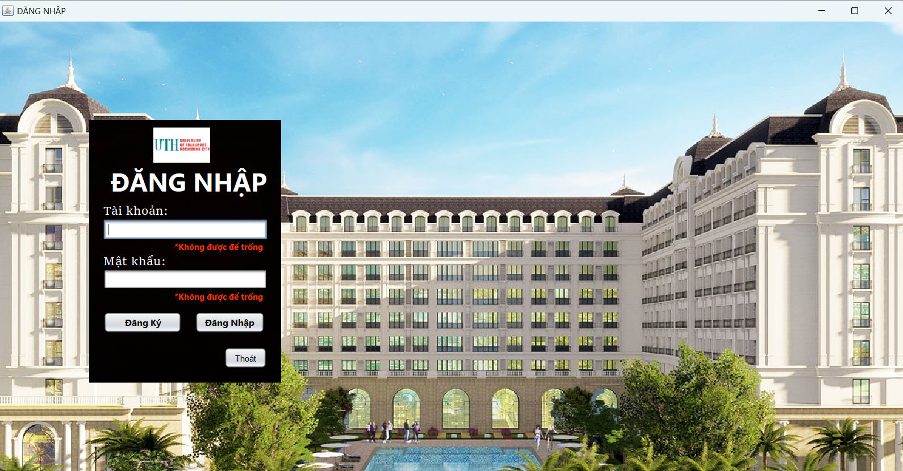
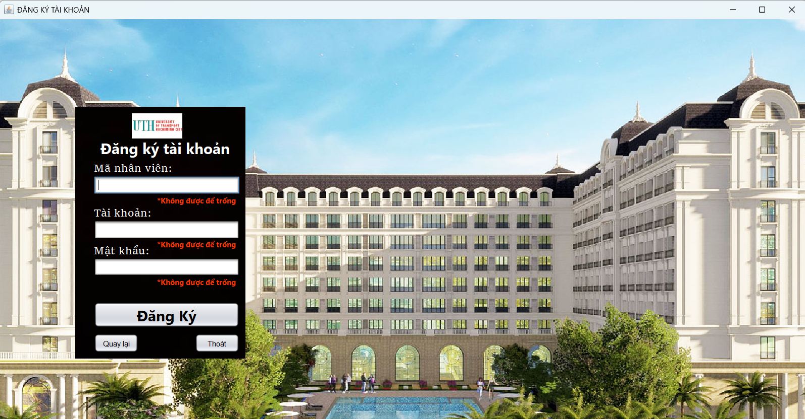
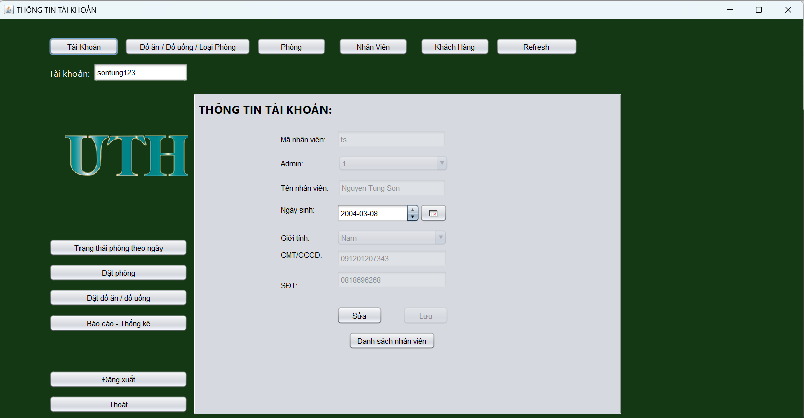
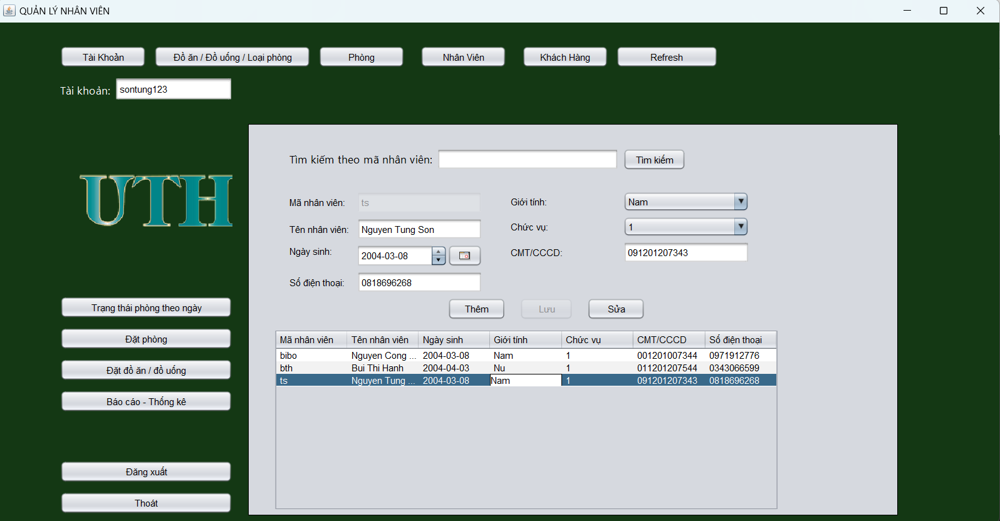
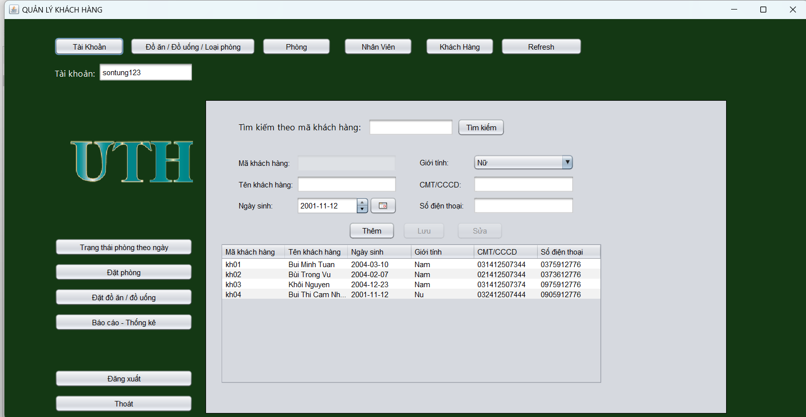
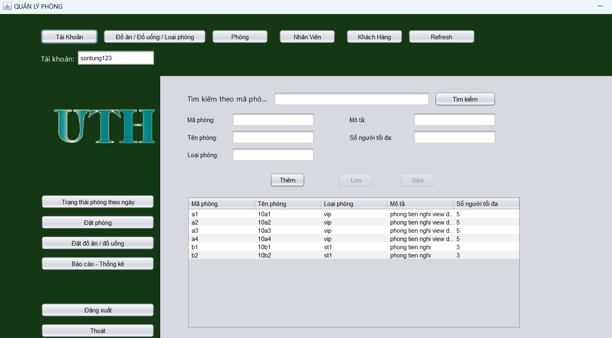
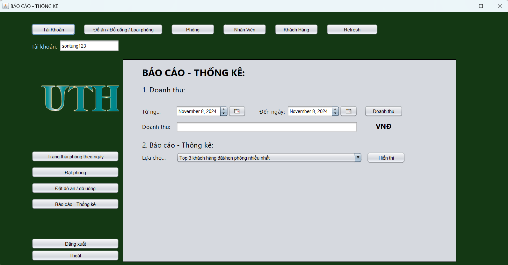

<<<<<<<< HEAD:README.md
# Phần mềm quản lý khách sạn

**1. Mô tả**

- Xây dựng ứng dụng quản lý khách sạn (Desktop) với các chức năng chính sau:
  - Quản lý phòng, đặt phòng
  - Quản lý khách hàng
  - Quản lý đồ ăn, uống
  - ...
- Mục tiêu:
  - Xây dựng một cơ sở dữ liệu hoàn chỉnh, có sử dụng stored procedure, trigger,...
  - Xây dựng giao diện ứng dụng
- Công nghệ sử dụng:
  - Java Swing
  - NeatBeans IDE, SQL Server

**2. Cài đặt**

- Cài jdk 22, NeatBeans IDE, SQL Server
- Cài đặt cơ sở dữ liệu với file **.sql** trong folder **/database**

**3. Giao diện chính**

<h4 align="center">Đăng nhập</h4>

---

<h4 align="center">Đăng ký tài khoản</h4>

---

<h4 align="center">Trang chủ</h4>

---

<h4 align="center">Quản lý nhân viên</h4>

---

<h4 align="center">Quản lý khách hàng</h4>

---

<h4 align="center">Quản lý phòng</h4>

---

<h4 align="center">Báo cáo/Thống kê</h4>

<h4 align="center">...</h4>
========

>>>>>>>> 4d00b2172765b51c6ff90f8dfc2ad55b3ec2f8f1:QLKS_PM/README.md
